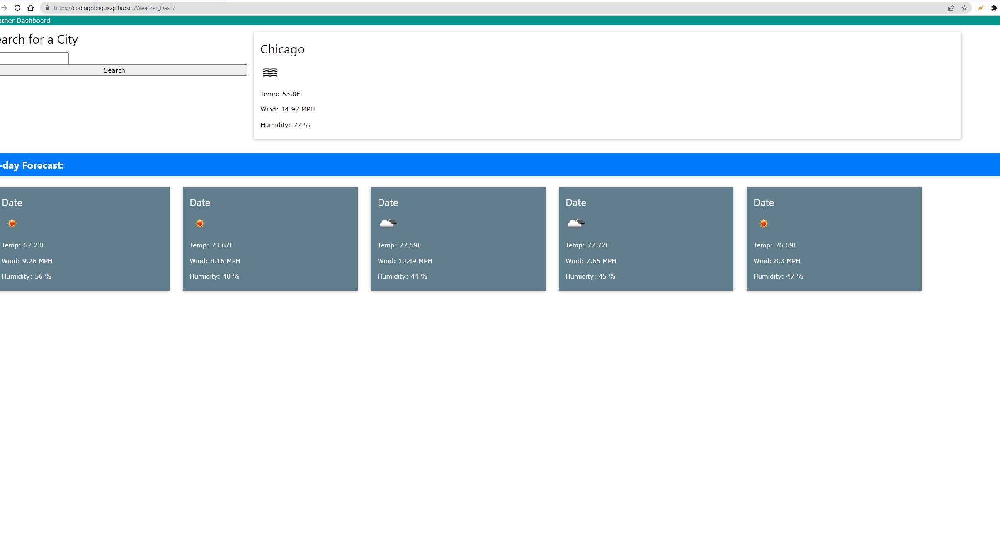

# Weather_Dash

## Description

Motivation: The motivation behind building this project could be to provide travelers with a convenient way to access weather information for their desired cities and plan their trips accordingly.

Purpose: The purpose of this project is to create a user-friendly weather dashboard that integrates with the OpenWeather API to fetch current and future weather conditions for cities specified by the user.

Problem-solving: This project solves the problem of manually searching for weather information for multiple cities by providing a single dashboard where users can search for cities, view current weather conditions, and see a 5-day forecast for each city. Additionally, it keeps a search history so that users can easily access previously searched cities.

Learning: By building this project, you can learn how to work with APIs, make HTTP requests to retrieve weather data, handle user input, store data locally using localStorage, and dynamically update the user interface based on the retrieved data.
## Installation
For installation, you can follow these steps:

Clone the project repository from the source control system or download the source code as a ZIP file.

Set up a development environment with the necessary tools and dependencies. This may include installing Node.js, a text editor or IDE, and any required libraries or frameworks specified in the project.

Open the project in your preferred text editor or IDE.

Set up an account with OpenWeather and obtain an API key. This key will be required to make requests to the OpenWeather API.

Create an HTML file for the weather dashboard and link the necessary CSS and JavaScript files.

Write the HTML structure for the dashboard, including form inputs for city search and containers to display the weather information.

Write JavaScript code to handle user interactions, make API requests to OpenWeather using the provided API key, parse the retrieved data, and update the UI with the weather information.

Implement functionality to store the search history using the localStorage API. When a user searches for a city, store it in localStorage and display it in the search history section of the dashboard.

Implement functionality to handle clicks on the search history items. When a user clicks on a city in the search history, retrieve the weather data for that city and update the UI accordingly.

Test the weather dashboard by entering different city names, verifying that the current and future weather conditions are displayed correctly, and ensuring that the search history persists across page refreshes.
## Features
Displaying additional weather information such as pressure, visibility, or precipitation.
Adding a feature to switch between metric and imperial units for temperature, wind speed, etc.
Implementing geolocation functionality to automatically detect the user's current location and display the weather for that location.
Providing suggestions or autocomplete functionality when typing in the city search input.
Adding animations or visual effects to enhance the user experience.

## Example:
https://codingobliqua.github.io/Weather_Dash/ 